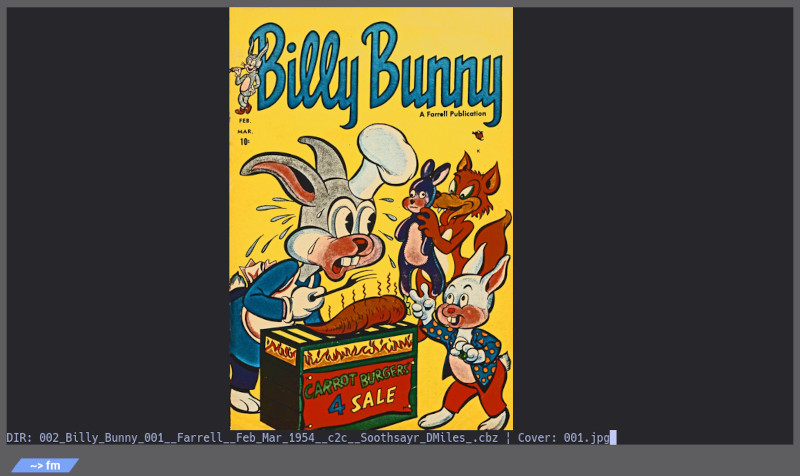
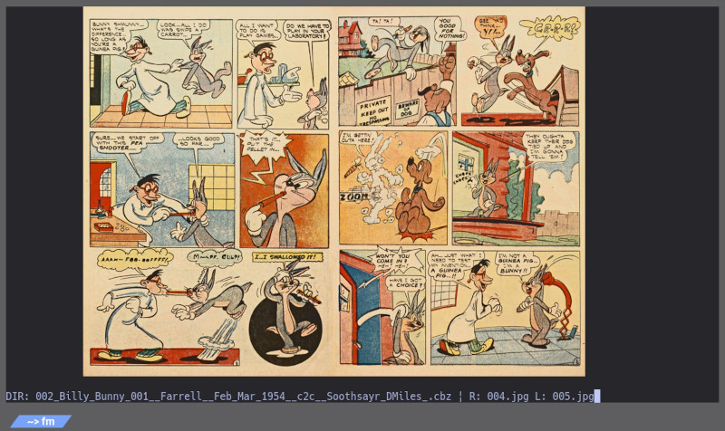

# TerMa (terma2)

> **Ter**minal **Ma**nga Viewer — *"タマ"*

> TerMa は **Kitty** / **WezTerm** / **Sixel対応ターミナル** などに対応したターミナル漫画ビューアです。Rust で書かれており、Kitty Graphics Protocol、WezTerm imgcat、または Sixel グラフィックスを使って表紙と見開きを表示し、キーボード操作を中心にマウス操作もサポートします。ターミナル上で完結し、片手で全ての操作を行えることを目標としています。

## 日本語版

Kitty、WezTerm、Sixel対応ターミナル向けの漫画ビューアです（Rust移植版）。
表紙は中央に表示され、2枚目以降は右綴じの見開き表示を行います。

### 特徴

- 1枚目は表紙として中央表示し、2枚目以降は右綴じの見開き表示を行います
- Kitty、WezTerm、Sixel対応ターミナルを自動検出して、対応する画像プロトコルを切り替えます
- キーボード主体の操作に加え、マウスクリックにも対応します
- 兄弟ディレクトリを自然順で辿って、次の巻へ移動できます
- 通常フォルダとアーカイブの前回表示位置を自動で保存・復元します
- Rust の `image` クレートにより、画像の縦横比を正確に判定して表示を安定させます
- 横向き画像（幅 > 高さ）を自動検出して単ページ表示に切り替えます
- ZIP/CBZ、RAR/CBR、TAR アーカイブを直接開けます（ネストされたアーカイブも自動展開）
- シングルページモード（`s` キー）で強制的に単ページ表示も可能
- `TERMA_DEBUG=1` でデバッグログを有効化できます

### サンプル画像


*表紙ページは中央に表示されます*


*2枚目以降は見開き（右綴じ）で表示されます*

### 必要要件

| 項目 | 内容 |
|------|------|
| Rust | 1.70 以上（ソースからビルドする場合） |
| ターミナル | Kitty / WezTerm / Sixel対応ターミナル |
| chafa | **Sixel対応ターミナル（foot, xterm, Windows Terminal等）で必要**です。Kitty/WezTermでは不要 |

### インストール

#### ビルド済み実行ファイル（推奨）

各OS向けのスタンドアロン実行ファイルを [Releases](https://github.com/radiconkid/terma2/releases) で配布しています。
Rust 環境がなくてもダウンロードしてそのまま実行できます。

```bash
# Linux
./terma-x86_64-linux /path/to/manga

# macOS
./terma-x86_64-macos /path/to/manga

# Windows
terma-x86_64-windows.exe C:\path\to\manga
```

> **注意**: Sixelターミナルをご利用の場合は、**chafa** を別途インストールしてください。
> Kitty または WezTerm の場合は chafa は不要です。

#### Cargo でインストール

```bash
cargo install --git https://github.com/radiconkid/terma2.git
```

#### ソースからビルド

```bash
git clone https://github.com/radiconkid/terma2.git
cd terma2
cargo build --release
./target/release/terma /path/to/manga/volume01
```

### 使い方

```bash
terma /path/to/manga/volume01
```

`volume01` と同階層にある兄弟ディレクトリが、自動的に次の巻として認識されます。

```text
manga/
├── volume01/   ← ここを指定すると…
├── volume02/   ← 次の巻として自動認識
└── volume03/
```

アーカイブファイルも直接開けます：

```bash
terma /path/to/manga/volume01.zip
terma /path/to/manga/volume01.cbz
terma /path/to/manga/volume01.tar
```

前回表示していた巻とページは自動的に保存され、同じフォルダまたはアーカイブを開くと続きから再開します。
レジューム情報は `~/.terma_resume.json` に保存されます。

### キーバインド

| キー | 動作 |
|------|------|
| `j` / `←` / `Enter` | 次のページへ |
| `k` / `l` / `→` | 前のページへ |
| `0` | 最初のページ（表紙）へ |
| `J` / `Shift` + `←` | 10ページ進む（ターボ） |
| `K` / `Shift` + `→` | 10ページ戻る（ターボ） |
| `1`〜`9` | 全体の 10%〜90% の位置へ移動 |
| `c` | カバーモードの切り替え（表紙表示あり/なし） |
| `r` | 読書方向の切り替え（右綴じ/左綴じ） |
| `s` | シングルページモードの切り替え（強制的に単ページ表示） |
| `,` | 次の巻へ |
| `.` | 前の巻へ |
| `q` / `Q` / `h` | 終了 |

### マウス操作

| 操作 | 動作 |
|------|------|
| 左クリック | 次のページへ |
| 右クリック | 前のページへ |
| 中クリック | 終了 |

### ターミナル対応

**動作確認済み**

| ターミナル | プロトコル | 検出方法 |
|------------|-----------|---------|
| Kitty | Kitty Graphics Protocol（icat） | `KITTY_WINDOW_ID` 環境変数 |
| WezTerm | imgcat（ネイティブ） | `WEZTERM_PANE` / `WEZTERM_UNIX_SOCKET` 環境変数 |
| foot | Sixel（chafa） | `TERM=foot*` |
| Windows Terminal | Sixel（chafa） | `WT_SESSION` 環境変数 |

**その他対応（理論上動作）**

| ターミナル | プロトコル | 検出方法 |
|------------|-----------|---------|
| XTerm互換端末 | Sixel（chafa） | `TERM` に `xterm` を含み `COLORTERM=truecolor` |
| mintty (Cygwin/MSYS2) | Sixel（chafa） | `TERM_PROGRAM=mintty` |
| mlterm / Contour | Sixel（chafa） | `TERM` の値で判定 |

tmux 経由でも環境変数による判定が有効です。
WezTerm が環境変数で検出できない場合、imgcat プローブによる自動検出を試みます。

### デバッグ

環境変数 `TERMA_DEBUG=1` を設定すると、デバッグログが **stderr** に出力されます。

```bash
TERMA_DEBUG=1 terma /path/to/manga/volume01
```

デバッグログには以下の情報が含まれます：

- ターミナル検出結果（Kitty / WezTerm / Sixel / Unknown）
- レンダラーの初期化状態（chafa / Kitty icat / WezTerm imgcat）
- 画像表示の試行と成否（chafa変換、フォールバック表示）
- レジューム状態の読み込み・保存（キー、ディレクトリ、画像インデックス）
- ディレクトリ走査結果（対象ディレクトリ一覧）
- エラー情報（chafa失敗、ファイル読み込みエラー等）

#### ファイルに保存する場合

stderr をファイルにリダイレクトしてください：

```bash
TERMA_DEBUG=1 terma /path/to/manga/volume01 2>~/terma-debug.log
```

#### ファイルと画面の両方に出力する場合

```bash
TERMA_DEBUG=1 terma /path/to/manga/volume01 2>&1 | tee ~/terma-debug.log
```

または stderr を別ファイルに保存しつつ画面にも表示：

```bash
TERMA_DEBUG=1 terma /path/to/manga/volume01 2>&1 | tee ~/terma-debug.log
```

#### 注意事項

- デバッグログは `eprintln!` マクロで stderr に出力されます
- 通常の画像データ（Sixel / Kitty Graphics Protocol）は **stdout** に出力されるため、stderr のリダイレクトは画像表示に影響しません
- 大量のログが出力されるため、問題が発生したときのみ有効にすることを推奨します

### プロジェクト構成

```text
terma2/
├── src/
│   ├── main.rs        # エントリポイント、ヘルプ表示
│   ├── app.rs         # メインアプリケーションループ
│   ├── display.rs     # 表示ロジック（単ページ/見開き判定）
│   ├── fileops.rs     # ファイル操作（ソート、アーカイブ展開）
│   ├── image.rs       # 画像ユーティリティ（アスペクト比、結合）
│   ├── renderer.rs    # 画像レンダリング（chafa/Kitty/WezTerm）
│   ├── resume.rs      # 再開状態の保存・復元
│   └── terminal.rs    # 端末検出・入力処理
├── assets/
│   ├── sample-cover.jpg
│   └── sample-spread.jpg
├── Cargo.toml
├── README.md
└── CHANGELOG.md
```

### コントリビューション

Issue・PR ともに歓迎します。

- バグ報告の際は OS・ターミナル名・バージョン・デバッグログを添えてください
- 機能追加の提案は Issue で先に議論していただけると助かります

### ライセンス

[MIT](https://github.com/radiconkid/terma2/blob/master/LICENSE)

---

## English

TerMa is a terminal manga viewer for **Kitty**, **WezTerm**, and Sixel-compatible terminals, rewritten in **Rust**.
It shows the cover page in the center and, from the second page onward, displays spreads in right-to-left reading order.

### Features

- The first page is shown as a centered cover page.
- From the second page onward, the viewer displays spreads using a right-bound layout.
- Kitty, WezTerm, and Sixel-compatible terminals are detected automatically, and the corresponding image protocol is selected.
- The application is keyboard-first and also supports mouse clicks.
- Sibling directories are traversed in natural sort order so the next volume is discovered automatically.
- The last viewed position is saved and restored automatically for normal folders and archives.
- The Rust `image` crate provides accurate aspect-ratio detection for reliable layout.
- Landscape images (width > height) are automatically detected and displayed as single pages.
- Direct archive support: open ZIP/CBZ, RAR/CBR, and TAR files directly (nested archives are extracted automatically).
- Single page mode (`s` key) forces single-page display.
- `TERMA_DEBUG=1` enables debug logging.

### Sample Images


*The cover page is shown in the center.*


*From the second page onward, the viewer shows spreads in right-to-left order.*

### Requirements

| Item | Details |
|------|---------|
| Rust | 1.70+ (when building from source) |
| Terminal | Kitty, WezTerm, or Sixel-compatible terminals |
| chafa | **Required for Sixel-compatible terminals** (foot, xterm, Windows Terminal, etc.). Not needed for Kitty/WezTerm |

### Installation

#### Pre-built binaries (recommended)

Standalone executables for each OS are available on the [Releases](https://github.com/radiconkid/terma2/releases) page.
No Rust environment required — just download and run.

```bash
# Linux
./terma-x86_64-linux /path/to/manga

# macOS
./terma-x86_64-macos /path/to/manga

# Windows
terma-x86_64-windows.exe C:\path\to\manga
```

> **Note**: If you use a Sixel terminal, you need to install **chafa** separately.
> Kitty and WezTerm users do not need chafa.

#### Install via Cargo

```bash
cargo install --git https://github.com/radiconkid/terma2.git
```

#### Build from source

```bash
git clone https://github.com/radiconkid/terma2.git
cd terma2
cargo build --release
./target/release/terma /path/to/manga/volume01
```

### Usage

```bash
terma /path/to/manga/volume01
```

Sibling directories next to `volume01` are automatically detected as the next volume.

```text
manga/
├── volume01/   ← start here
├── volume02/   ← automatically recognized as the next volume
└── volume03/
```

You can also open archive files directly:

```bash
terma /path/to/manga/volume01.zip
terma /path/to/manga/volume01.cbz
terma /path/to/manga/volume01.tar
```

The last viewed volume and page are saved automatically, so opening the same folder or archive resumes from that position.
Resume data is stored in `~/.terma_resume.json`.

### Key Bindings

| Key | Action |
|------|--------|
| `j` / `←` / `Enter` | Move to the next page |
| `k` / `l` / `→` | Move to the previous page |
| `0` | Jump to the first page (cover) |
| `J` / `Shift` + `←` | Move forward 10 pages (Turbo) |
| `K` / `Shift` + `→` | Move backward 10 pages (Turbo) |
| `1`〜`9` | Jump to 10% through 90% progress |
| `c` | Toggle cover mode (cover page on/off) |
| `r` | Toggle reading direction (right-to-left / left-to-right) |
| `s` | Toggle single page mode (force single-page display) |
| `,` | Move to the next volume |
| `.` | Move to the previous volume |
| `q` / `Q` / `h` | Quit |

### Mouse Controls

| Action | Behavior |
|--------|----------|
| Left click | Move to the next page |
| Right click | Move to the previous page |
| Middle click | Quit |

### Terminal Support

| Terminal | Protocol | Detection |
|----------|----------|-----------|
| Kitty | Kitty Graphics Protocol (`icat`) | `KITTY_WINDOW_ID` environment variable |
| WezTerm | imgcat (native) | `WEZTERM_PANE` / `WEZTERM_UNIX_SOCKET` environment variables |
| Windows Terminal | Sixel (chafa) | `WT_SESSION` environment variable |
| foot | Sixel (chafa) | `TERM=foot*` |
| XTerm-compatible | Sixel (chafa) | `TERM` contains `xterm` and `COLORTERM=truecolor` |
| mintty (Cygwin/MSYS2) | Sixel (chafa) | `TERM_PROGRAM=mintty` |
| mlterm / Contour | Sixel (chafa) | `TERM` value |

Environment variable detection also works when launched from tmux.
If WezTerm is not detected via environment variables, an imgcat probe is attempted as a fallback.

### Debug

```bash
TERMA_DEBUG=1 terma /path/to/manga/volume01
```

Debug logs are written to stderr. Redirect to a file if needed:

```bash
TERMA_DEBUG=1 terma /path/to/manga/volume01 2>~/terma-debug.log
```

### Project Structure

```text
terma2/
├── src/
│   ├── main.rs        # Entry point, help display
│   ├── app.rs         # Main application loop
│   ├── display.rs     # Display logic (single/spread detection)
│   ├── fileops.rs     # File operations (sorting, archive extraction)
│   ├── image.rs       # Image utilities (aspect ratio, combining)
│   ├── renderer.rs    # Image rendering (chafa/Kitty/WezTerm)
│   ├── resume.rs      # Resume state persistence
│   └── terminal.rs    # Terminal detection & input handling
├── assets/
│   ├── sample-cover.jpg
│   └── sample-spread.jpg
├── Cargo.toml
├── README.md
└── CHANGELOG.md
```

### Contributing

Issues and pull requests are welcome.

- Include your OS, terminal name, version, and debug log when reporting a bug.
- Feature ideas are best discussed in an issue before implementation.

### License

[MIT](https://github.com/radiconkid/terma2/blob/master/LICENSE)
